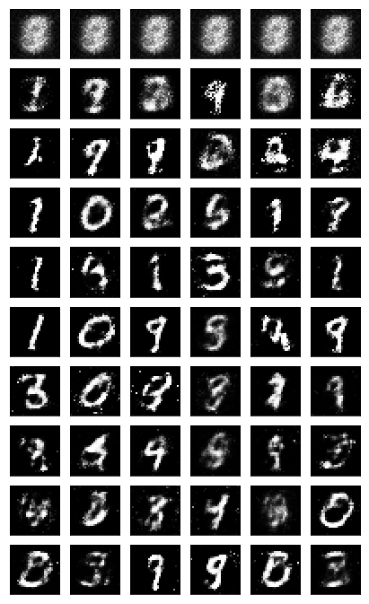

# Handwritten-digits-generation
a PyTorch implementation - handwritten digits generation/recognition with GAN model using MNIST Dataset

## Project Goal 
The goal is to generate new handwritten digits using a generative adversarial network (GAN) trained on the MNIST dataset.
## GAN(Generative Adversarial Network)
GANs were first reported on in 2014 from Ian Goodfellow and others in Yoshua Bengio's lab. Since then, GANs have exploded in popularity. 
The idea behind GANs is using two networks, a generator  G  and a discriminator  D , competing against each other. The generator makes "fake" data to pass to the discriminator. The discriminator also sees real training data and predicts if the data it's received is real or fake.

The generator is trained to fool the discriminator, it wants to output data that looks as close as possible to real, training data.
The discriminator is a classifier that is trained to figure out which data is real and which is fake.
What ends up happening is that the generator learns to make data that is indistinguishable from real data to the discriminator.

The general structure of a GAN is using MNIST images as data. The latent sample is a random vector that the generator uses to construct its fake images. This is often called a latent vector and that vector space is called latent space. As the generator trains, it figures out how to map latent vectors to recognizable images that can fool the discriminator.
## GAN : Define the Model
A GAN is comprised of two adversarial networks, a discriminator and a generator.
### Discriminator
The discriminator network is going to be a pretty typical linear classifier. To make this network a universal function approximator, at least one hidden layer is needed, and these hidden layers should have one key attribute:

All hidden layers will have a Leaky ReLu activation function applied to their outputs.
Leaky ReLu: A leaky ReLU is used to allow gradients to flow backwards through the layer unimpeded. A leaky ReLU is like a normal ReLU, except that there is a small non-zero output for negative input values.

### Generator 
The generator network will be almost exactly the same as the discriminator network, except applying a tanh activation function to the output layer.

> tanH Output : The generator has been found to perform the best with  tanh  for the generator output, which scales the output to be between -1 and 1, instead of 0 and 1.

### Discriminator and Generator Losses
#### Discriminator Losses
For the discriminator, the total loss is the sum of the losses for real and fake images, `d_loss = d_real_loss + d_fake_loss`.
> loss : The discriminator to output 1 for real images and 0 for fake images

The discriminator loss for the fake data is similar. We want D(fake_images) = 0, where the fake images are the generator output, fake_images = G(z).

#### Generator Loss
The generator loss will look similar only with flipped labels. The generator's goal is to get D(fake_images) = 1. In this case, the labels are flipped to represent that the generator is trying to fool the discriminator into thinking that the images it generates (fakes) are real.

### ㅆraining
Training will involve alternating between training the discriminator and the generator. Loss functions `real_loss` and `fake_loss` are to calculate the discriminator losses in all of the following cases.

#### Discriminator training
1. Compute the discriminator loss on real, training images
2. Generate fake images
3. Compute the discriminator loss on fake, generated images
4. Add up real and fake loss
5. Perform backpropagation + an optimization step to update the discriminator's weights
#### Generator training
1. Generate fake images
2. Compute the discriminator loss on fake images, using flipped labels!
3. Perform backpropagation + an optimization step to update the generator's weights

## Result

## Reference 
* [2014 Generative Adversarial Network](https://arxiv.org/abs/1406.2661)
* [Pix2Pix]
* [CycleGAN & Pix2Pix](https://github.com/junyanz/pytorch-CycleGAN-and-pix2pix)
* [A list of generative models](https://github.com/wiseodd/generative-models)
* [Image-to-Image Demo](https://affinelayer.com/pixsrv/)
